# Git代码管理及相关操作指示

| 创建时间 |                            内容                            | 待补充                      |    版本    |   ID   |
| :------: | :--------------------------------------------------------: | --------------------------- | :--------: | :----: |
| 2026.8.4 | 图形化vscode+git<br />+github相关操作内容（个人/团队协作） | gitlab相关<br />git高级操作 | git_v_demo | 杜宇晖 |
|          |                                                            |                             |            |        |
|          |                                                            |                             |            |        |
|          |                                                            |                             |            |        |
|          |                                                            |                             |            |        |
|          |                                                            |                             |            |        |
|          |                                                            |                             |            |        |

|   github账号邮箱   |   ID   |
| :-----------------: | :----: |
| 15536929161@163.com | 杜宇晖 |
|                    |        |
|                    |        |
|                    |        |
|                    |        |
|                    |        |
|                    |        |

## 一、相关准备操作（git下载+github账号）

[git下载地址](https://git-scm.com/install/windows)


[git下载视频](https://www.bilibili.com/video/BV1Hkr7YYEh8/?spm_id_from=333.1007.top_right_bar_window_history.content.click&vd_source=a1acc8b39438827ab92808015613ee78)

**注意在安装的时候选择vscode作为默认编辑器**


[git配置官方教程](https://git-scm.com/book/en/v2/Getting-Started-First-Time-Git-Setup)

***配置github账号：***

`git config --global user.name "John Doe"`

`git config --global user.email johndoe@example.com`

配置完成后vscode账户会显示与github账号的绑定


***配置网络：***

可以从电脑设置打开网络查看


请根据自己电脑系统中的网络设置更改相应的地址和端口

`git config --global http.proxy http://127.0.0.1:10808`

`git config --global https.proxy http://127.0.0.1:10808`


## 二、自用管理操作流程

### 1.创建新的库并同步代码管理

* 打开vscode打开一个工程文件
* 打开侧边栏初始化仓库（建立本地库）


* 修改文件后进行第一次上传提交，可以自定义命名（此处命名为每一次更改的存档命名，只会在下方的图表里显示，仅为记录更改历史）


* 同步到github上（如果之前创建了对应名称的库可以直接绑定，如果没有创建则会自动在github上创建一个自定义名字的库并且添加绑定关系）


* github自动上传/生成到对应的库里面**【！！！如果出现错误，检查网络配置问题，并在终端输入对应的命令解决！！！】**


* 之后的更改依次按照**1.自定义命名提交----->2.同步更改保持云端同步**


* 然后观察图表中蓝色的main表示本地仓库的提交进度，紫色的表示云端（github仓库）的提交进度，同时可以根据图表中的历史记录查看每次所作出的修改


### 2.已有库并添加代码进行同步管理

* github上新建一个仓库(这个库如果和之后的工程名字一致则会自动链接到这个同名库里，否则会创建一个根据你自定义名字的新库)


* 输入对应仓库名/选择公开或者私密**【！！！不要打开Add README，下面的Add任何一个都不要点，必须确保创建的时候是纯空仓库！！！】**


* 在vscode里面的操作同上（初始化仓库），之后在源代码管理界面添加远程仓库


* 从github添加远程库


* 选择对应远程仓库并输入远程库自定义名称（注意这里的名称是本地为了标识远程库所记忆的一个代号条目，不代表云端github仓库的名字，如果之后一个本地仓库对应多个远程仓库或者要上传到不止一个平台----------github/gitlab/...等作为名称区别判断）


* 链接完成后发布branch即可同步更新

**【！！！如果该远程仓库不是一个空仓库，存在先前别人/自己创建的main，无法进行同步会产生冲突，如果想不动原先仓库存在的内容、只同步添加自己想要上传的其他文件，需要创建分支后再进行同步！！！】**


如图所示，我创建了一个other分支，原先的仓库gittest里面存在main，同步之后即可看到不同分支的代码内容


这样操作使得新建的分支和main是完全独立的进程，后续**无法合并到主分支main里面**，若始终保持分支采取独立内容，则不受影响，个人仓库自用时可以暂时忽略，更为规范的操作在协作管理流程里面描述。


## 三、协作管理操作流程

### 1.作为发起/管理者

**新建仓库/已有仓库------>邀请成员加入------->设置规则管理------->审批他人提交的PR请求------->合并主分支**

* 在选定的仓库页面找到设置根据邮箱账号/ID添加群成员


* 在设置里面设置分支提交规则――new branch ruleset（审查机制）（include by pattern即可制定规则生效分支


**【！！！如果不设置审批的话任何一个成员自己的同步更新则会直接刷新仓库的主分支，会造成混乱，正确的做法是:提交PR请求---->审批后并入主分支！！！】**


**【！！！私有化仓库只有付费才能受用规则，为了方便可以择时设置为公开仓库！！！】**


在设置里面的general栏目最下方可以更改private/public


* 当出现PR请求时候进行审批操作然后并入主分支

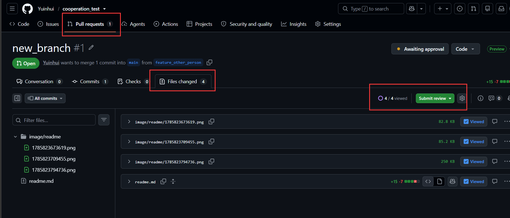

* 审查完之后点击`Review changes――Approve`后即可提交

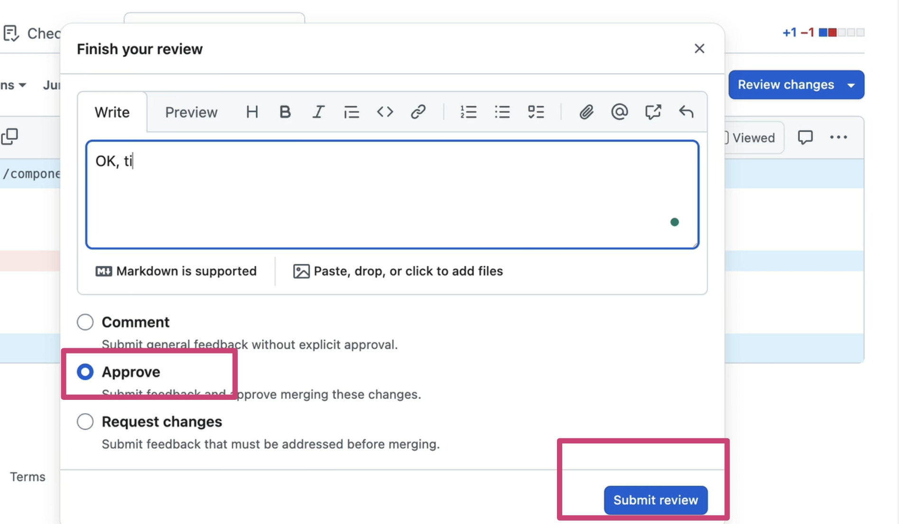

* 提交后即可看到合并的操作，点击后填写该次合并标题和合并描述即可完成到合并主分支

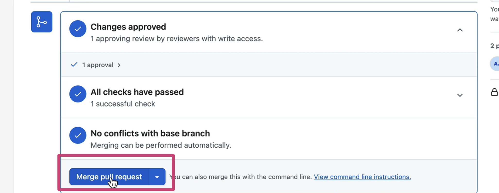

* 合并完成查看主仓库确认更新无误后即可删除之前的临时分支，从`branch--->view all branches`进行对应删除即可

### 2.作为成员/参与者

**克隆仓库------>修改或补充内容------->创建新分支------->提交同步------->提交PR请求**

* 打开vscode源代码管理选择克隆仓库，选择对应的仓库拷贝工程到本地


* 修改代码后点击左下角分支名新建分支并自定义分支名后提交并同步到对应仓库


* 回到github仓库页面可以看到作为独立分支推送上去，同时下一步我们进行一个合并请求，可以直接点击`compare & pull request`或者在`Pull requests`里新建一个`pull request`

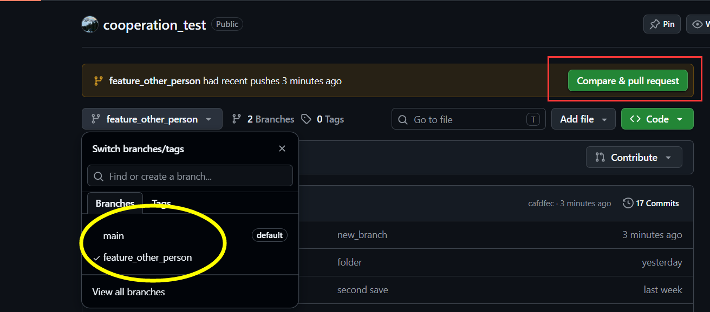

* 查看抬头，确认是正确的分支合并到主分支并填写对应的请求描述或者细节内容后创建请求

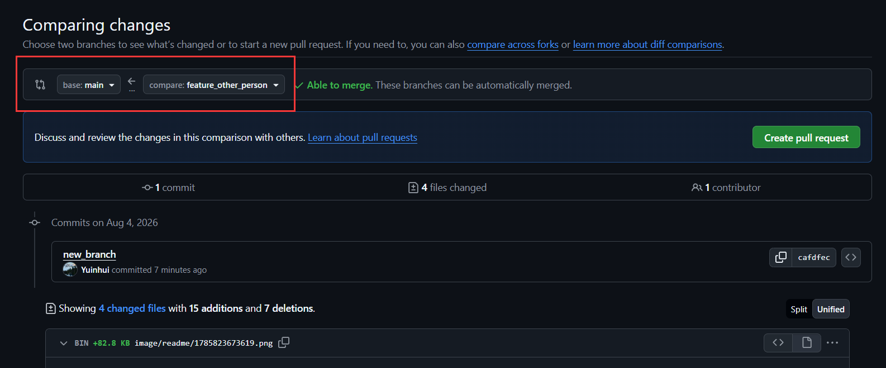

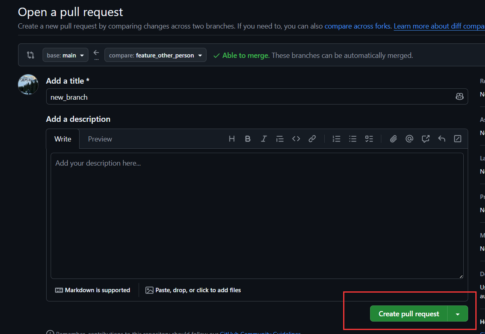

* 提交后等待别人/管理员审批后进行合并即可

### 3.本地同步仓库云端更新的内容

* 当他人对仓库里的工程进行修改后，云端的github仓库里代码的进度和本地的进度不一致的时候，我们需要同步，直接借助vscode图像化界面操作，进入源代码管理依次点击图标旁边的红框中的两个按钮`从所有远程库抓取---------->拉取`即可从云端同步到本地


## 四、常见其他操作

### 一、怎么查看当前默认对应哪个仓库

终端运行：

`git branch -vv`

也可以用：

`git status`

查看当前链接远程仓库

`git remote -v`

### 二、推送到多个远程仓库明确写远程名称

当一个本地仓库链接多个远程仓库时

`git push <远程仓库别名> <本地分支名>`

注意这里的远程仓库别名是之前你本地设置的对应标签，不是远程仓库的名字，查看`git remote -v`即可找到对应关系

例如推送到原来的 `gitdemo`：

`git push origin main`

推送到指定的远程仓库 `cooperation_test`(之前自定义对应的名字是github)：

`git push github main`

从原仓库获取更新：

`git pull origin main`

设置默认推送仓库：

`git push -u github main`

把本地main分支对应的上游设置为远程仓库`cooperation_test`，这样后面使用`git push`自动推送到该仓库

修改默认上游：

`git fetch github`获取该远程分支

`git branch --set-upstream-to=github/main main`

### 三、回滚版本

* 在没有`提交`前，可以在更改里面选择`放弃所有更改`/或者在下方的单个文件中点击`放弃更改`

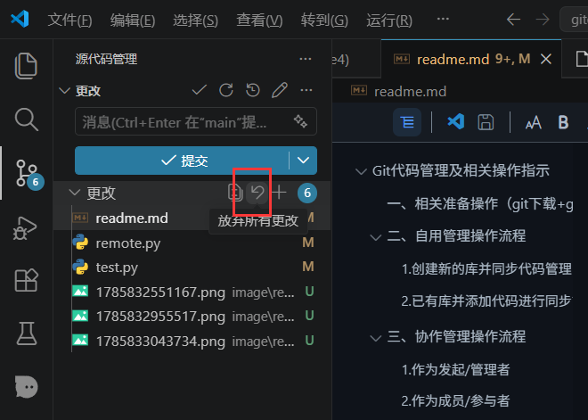

* 在`提交`后，需要使用插件进行回滚，插件下载`GitLens`

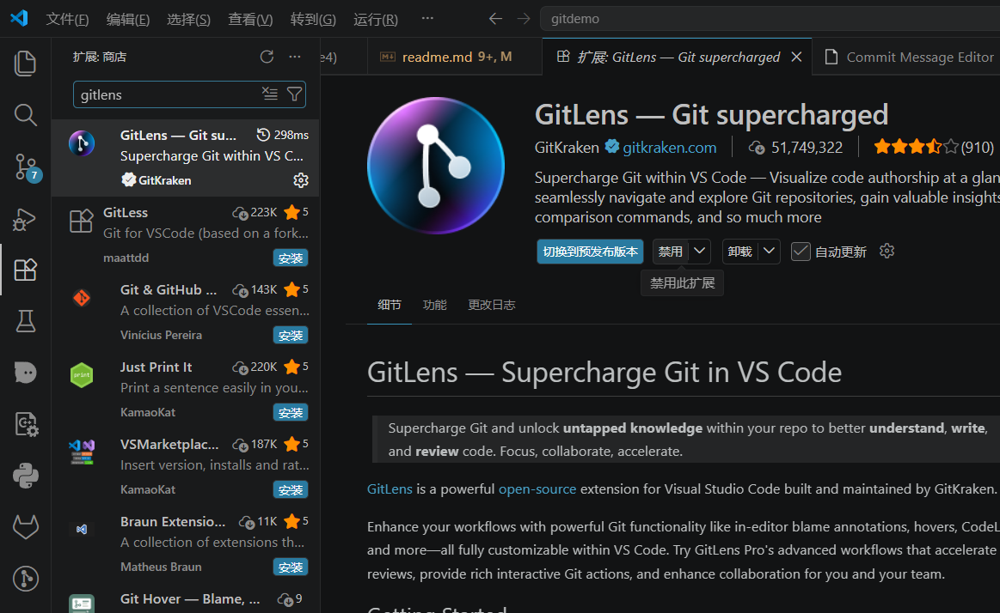

打开源代码管理下的`gitlens`，找对对应的版本条目右键，**如果只是本地提交没有远程仓库同步的话，选择`Reset`，这样不会新增添一个记录（即消灭掉一个错误的提交记录），如果跟别人一起协作且在远程上有同步，选择`Revert`,这样别人也可以查看到相应的改动记录**

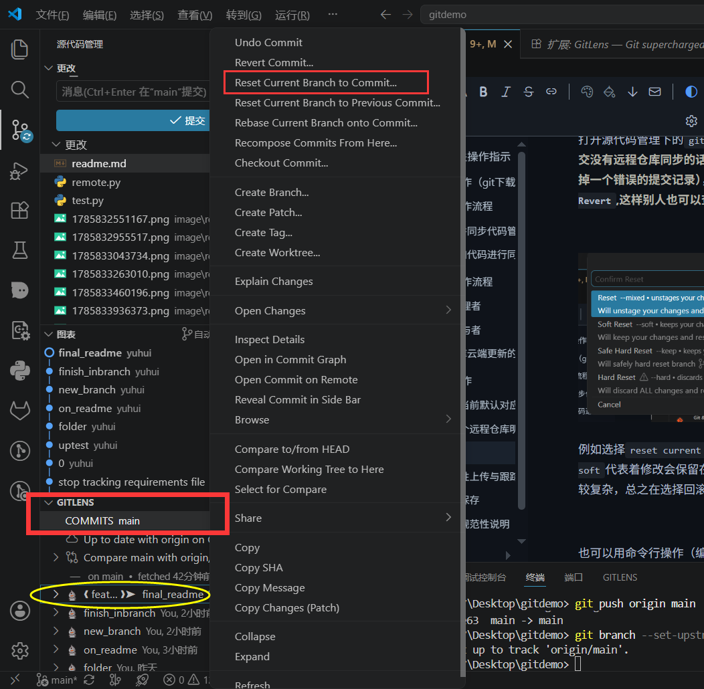

例如选择`reset current branch to commit`后会弹出几种选项，简单来讲，`soft`代表着修改会保留在缓冲区，`hard`直接强行删除掉更改，其他几种比较复杂，总之在选择回滚的时候需要谨慎操作！

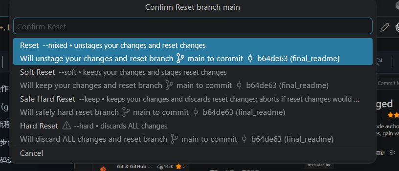

也可以用命令行操作（编号可以从操作历史里面查找)：

`git revert <提交编号>`

这样做不会删除历史，相当于创建一个新的反向提交：

`A → B → 错误提交C → 撤销C的提交D`

然后再推送`git push`

### 四、文件选择性上传与跟踪管理

一次性修改多个文件但不是所有文件都要提交上传同步，在待更改的文件点击`+`加入暂存区，这样提交只会提交暂存区的更改

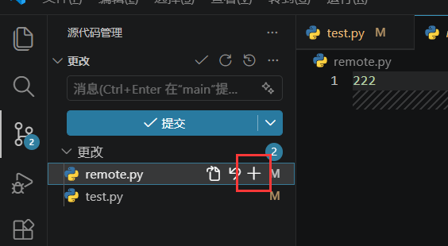

新建`.gitignore`文件里面标明不需要上传的文件/文件夹，例如**下载安装的配置文件/下载的项目依赖/工程产生的运行文件**等等


这些文件将在后续的更改中被git忽视跟踪，修改/新增/删除都不会产生相应的同步变化到本地和远程仓库中

> ！！！注意只有在git没有事先跟踪过这些文件下才生效，比如之前已经commit/sync这些文件，之后才新建`.gitignore`把这些文件写进去，相当于本地仓库已经跟踪过，那此时的`gitignore`无法生效
> 如需删除跟踪关系，终端输入`git rm --cached requirement.txt`,同时`.gitignore`中加入该文件名即可在新一次的commit/sync中取消上传

```
git rm --cached requirement.txt
```

### 五、分支文件保存

输入`git reflog --all --date=local`查看所有分支下的文件保存记录，假如切换分支发现文件版本回退的话，云端github上还没来得及同步，就要查看本地的分支里面是否仍然保存。当发现文件删除错误/分支保存错误/切换分支文件错乱等的时候建议同步使用ai帮助恢复。

### 六、提交存档规范性说明

[约定式提交](https://www.conventionalcommits.org/zh-hans/v1.0.0/)<-------点击即可查看官方更为专业的说明和指示

一个良好的提交记录方便自己和他人协同时的查看，简化了需要打开图标找到对应文件查看的复杂性，我们可以采用插件帮助来建立书写模版，从vscode扩展中搜索`Commit Message Editor`完成下载

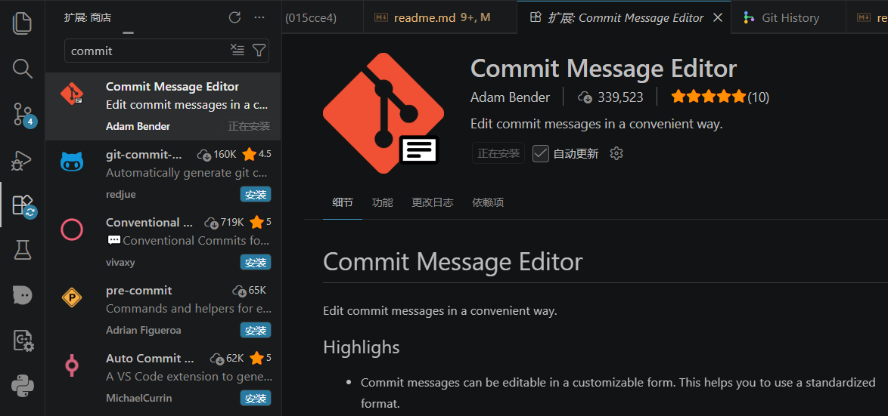

之后在提交时可以`通过点击更改栏目红框里面的笔画，进入模版选择，然后选择修改类型和对应简单注释，系统会自动生成提交的存档名字`

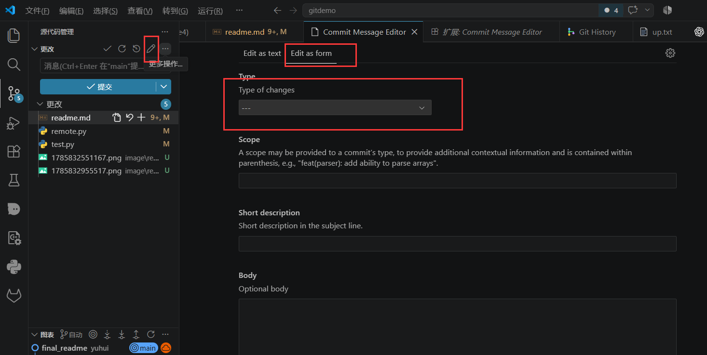


## 五、问题汇总

##### 1.我加入了一个私有仓库，但是没法从主页看到，怎么解决？

点击`github头像-------->settings--------->Repositors`可以查看到你在其中的别人创建的私有仓库。

##### 2.我自己创建的仓库，我自己修改代码直接并入到主分支是否可行？

免费版不行，也需要通过同`三.2`里面的方式进行新建分支/上传/新建PR申请。（管理者自己）如果不想受限于自己的规则，自由更改不经过其他人审查可以把规则`disabled`然后再启用。

##### 3.推送到除了github的其他平台（gitee/gitlab/...），怎么操作？

需要提前在对应的平台上创建好远程仓库，**得到远程地址（https链接)**，然后通过添加远程库的形式输入地址添加

##### 4.终端输入命令查看日志，按回车会不断刷新历史记录，怎么退出？

按`q`退出

##### 5.不想每次`commit`都标记一个存档名，怎么办？

点击提交旁边的提交（修改Amend），确认后相当于使用上一次存档名的基础上更新

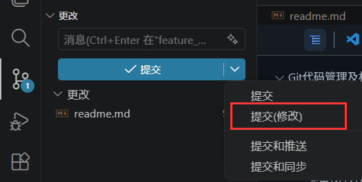
