# Git代码管理及相关操作指示

| 创建时间 |                            内容                            | 待补充                    | 版本 |   ID   |
| :------: | :--------------------------------------------------------: | ------------------------- | :--: | :----: |
| 2026.8.3 | 图形化vscode+git<br />+github相关操作内容（个人/团队协作） | gitlab相关<br />git命令行 | demo | 杜宇晖 |
|          |                                                            |                           |      |        |
|          |                                                            |                           |      |        |
|          |                                                            |                           |      |        |
|          |                                                            |                           |      |        |
|          |                                                            |                           |      |        |
|          |                                                            |                           |      |        |

| github账号邮箱 |   ID   |
| :------------: | :----: |
|                | 杜宇晖 |
|                |        |
|                |        |
|                |        |
|                |        |
|                |        |
|                |        |

## 一、相关准备操作（git下载+github账号）

[git下载地址](https://git-scm.com/install/windows)

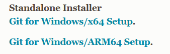

[git下载视频](https://www.bilibili.com/video/BV1Hkr7YYEh8/?spm_id_from=333.1007.top_right_bar_window_history.content.click&vd_source=a1acc8b39438827ab92808015613ee78)

**注意在安装的时候选择vscode作为默认编辑器**

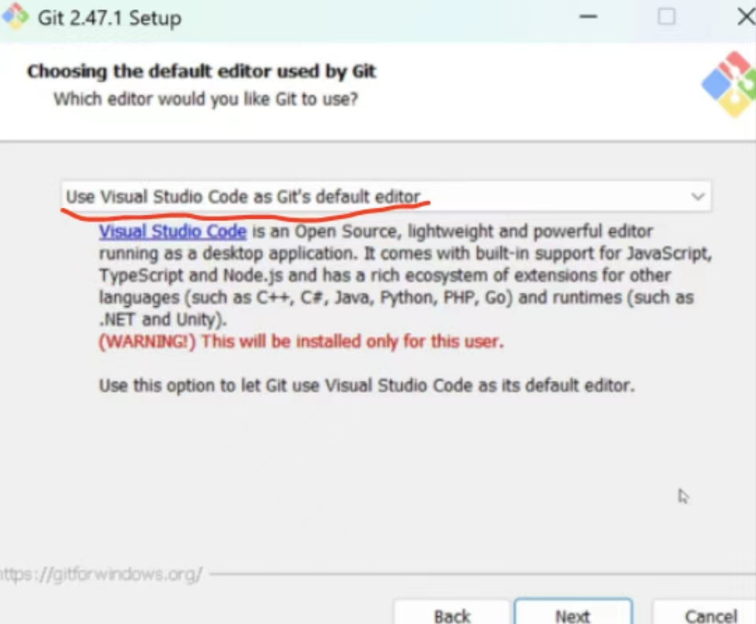

[git配置官方教程](https://git-scm.com/book/en/v2/Getting-Started-First-Time-Git-Setup)

***配置github账号：***

`git config --global user.name "John Doe"`

`git config --global user.email johndoe@example.com`

配置完成后vscode账户会显示与github账号的绑定

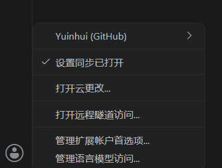

***配置网络：***

可以从电脑设置打开网络查看

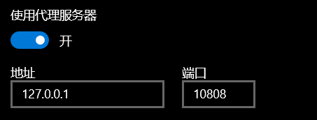

请根据自己电脑系统中的网络设置更改相应的地址和端口

`git config --global http.proxy http://127.0.0.1:10808`

`git config --global https.proxy http://127.0.0.1:10808`

## 二、自用管理操作流程

### 1.创建新的库并同步代码管理

* 打开vscode打开一个工程文件
* 打开侧边栏初始化仓库（建立本地库）

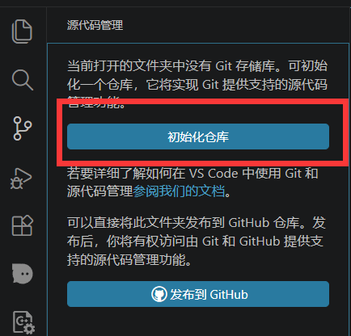

* 修改文件后进行第一次上传提交，可以自定义命名（此处命名为每一次更改的命名，只会在下方的图表里显示，仅为记录更改历史）

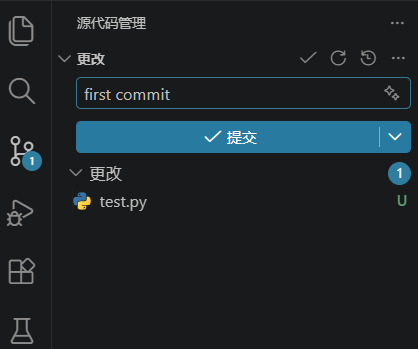

* 同步到github上（如果之前创建了对应名称的库可以直接绑定，如果没有创建则会自动在github上创建一个自定义名字的库并且添加绑定关系）

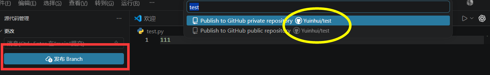

* github自动上传/生成到对应的库里面**【！！！如果出现错误检查网络配置问题，并在终端输入对应的命令解决！！！】**

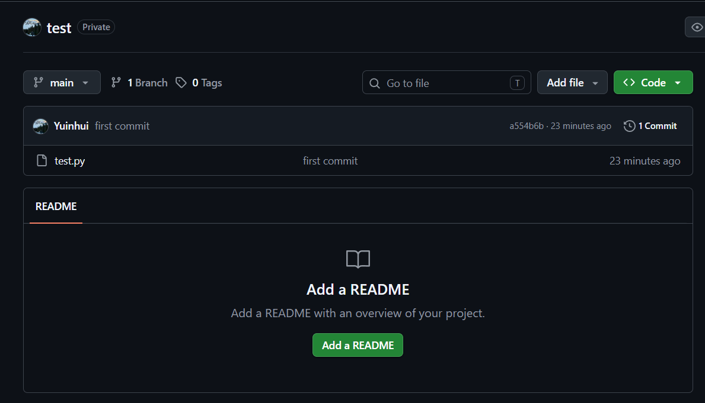

* 之后的更改依次按照**1.自定义命名提交----->2.同步更改保持云端同步**

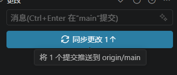

* 然后观察图表中蓝色的main表示本地仓库的提交进度，紫色的表示云端（github仓库）的提交进度，同时可以根据图表中的历史记录查看每次所作出的修改

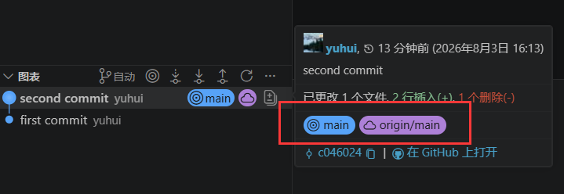

### 2.已有库并添加代码进行同步管理

* github上新建一个仓库(这个库如果和之后的工程名字一致则会自动链接到这个同名库里，否则会创建一个根据你自定义名字的新库)

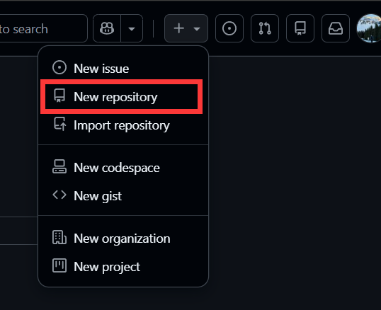

* 输入对应仓库名/选择公开或者私密**【****！！！不要打开Add README！！！】**

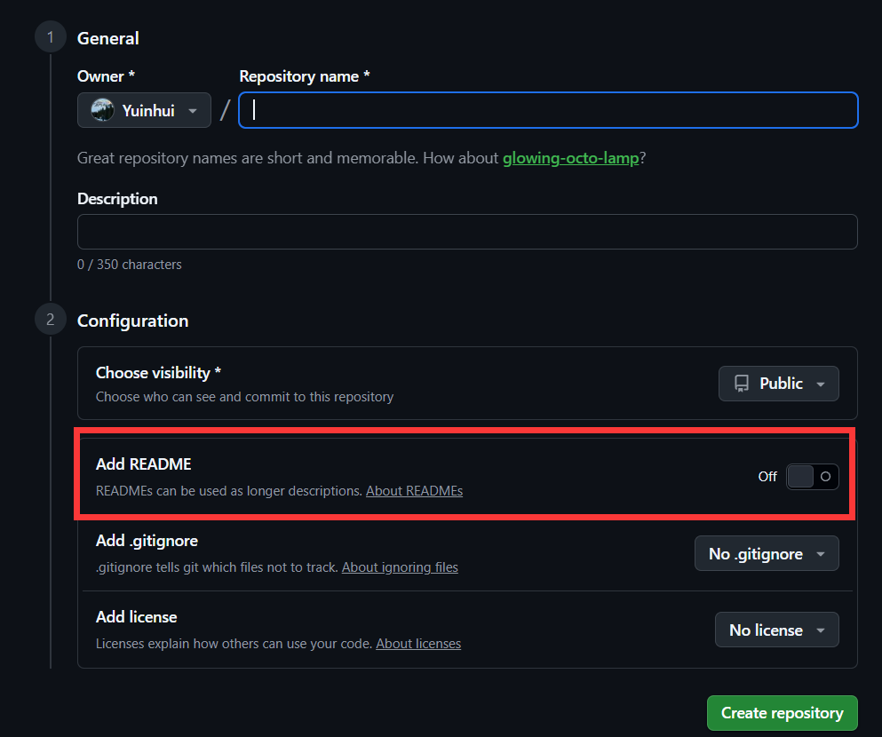

* 在vscode里面的操作同上（初始化仓库），之后在源代码管理界面添加远程仓库

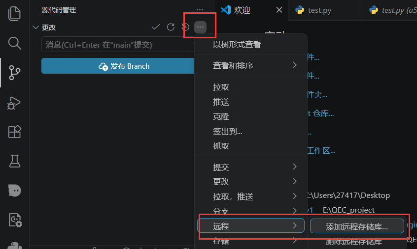

* 从github添加远程库

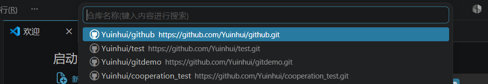

* 选择对应远程仓库并输入远程库自定义名称（注意这里的名称是本地为了标识远程库所记忆的一个代号条目，不代表云端github仓库的名字，如果之后一个本地仓库对应多个远程仓库或者要上传到不止一个平台----------github/gitlab/...等作为名称区别判断）

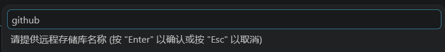

* 链接完成后发布branch即可同步更新

**【！！！如果该远程仓库不是一个空仓库，存在先前别人/自己创建的main，无法进行同步会产生冲突，如果想不动原先仓库存在的内容、只同步添加自己想要上传的其他文件，需要创建分支后再进行同步！！！】**

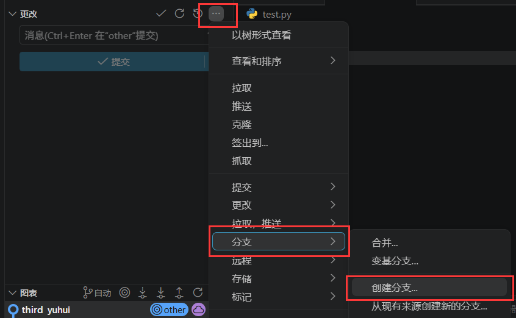

如图所示，我创建了一个other分支，原先的仓库gittest里面存在main，同步之后即可看到不同分支的代码内容

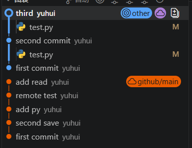

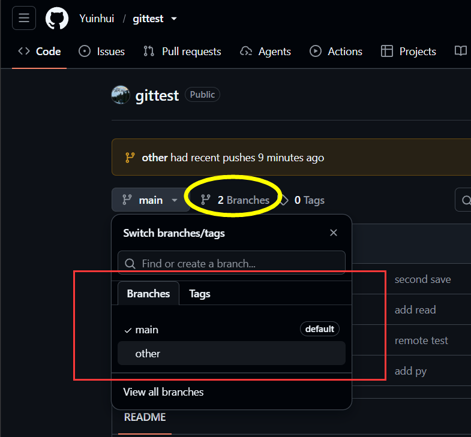

这样操作使得新建的分支和main是完全独立的进程，后续**无法合并到主分支main里面**，若始终保持分支采取独立内容，则不受影响，个人仓库自用时可以暂时忽略，更为规范的操作在协作管理流程里面描述。

## 三、协作管理操作流程

### 1.作为发起/管理者

**新建仓库/已有仓库------>邀请成员加入------->设置规则管理------->审批他人提交的PR请求------->合并主分支**

* 在选定的仓库页面找到设置根据邮箱账号/ID添加群成员

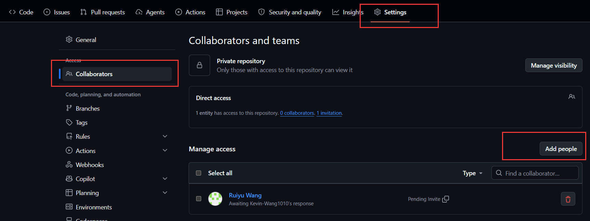

* 在设置里面设置分支提交规则――new branch ruleset（审查机制）（include by pattern即可制定规则生效分支

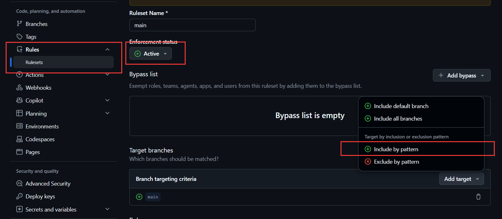

**【！！！如果不设置审批的话任何一个成员自己的同步更新则会直接刷新仓库的主分支，会造成混乱，正确的做法是:提交PR请求---->审批后并入主分支！！！】**

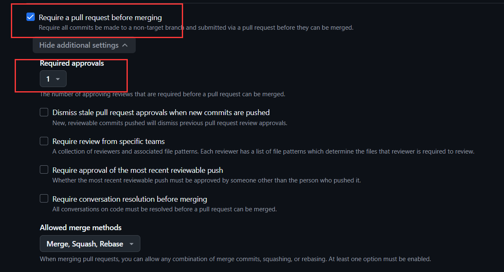

**【！！！私有化仓库只有付费才能受用规则，为了方便可以择时设置为公开仓库！！！】**

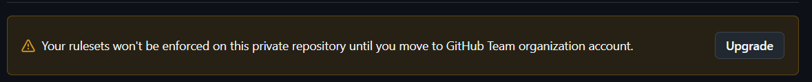

在设置里面的general栏目最下方可以更改private/public

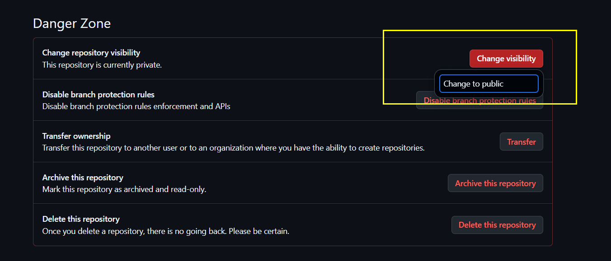

* 当出现PR请求时候进行审批操作然后并入主分支

### 2.作为成员/参与者

**克隆仓库------>修改或补充内容------->创建新分支------->提交同步------->提交PR请求**

* 打开vscode源代码管理选择克隆仓库，选择对应的仓库拷贝工程到本地

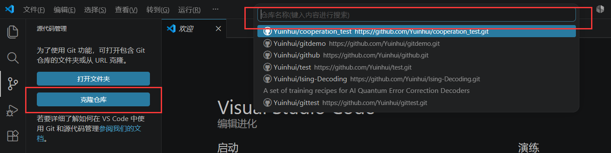

* 修改代码后点击左下角分支名新建分支并自定义分支名

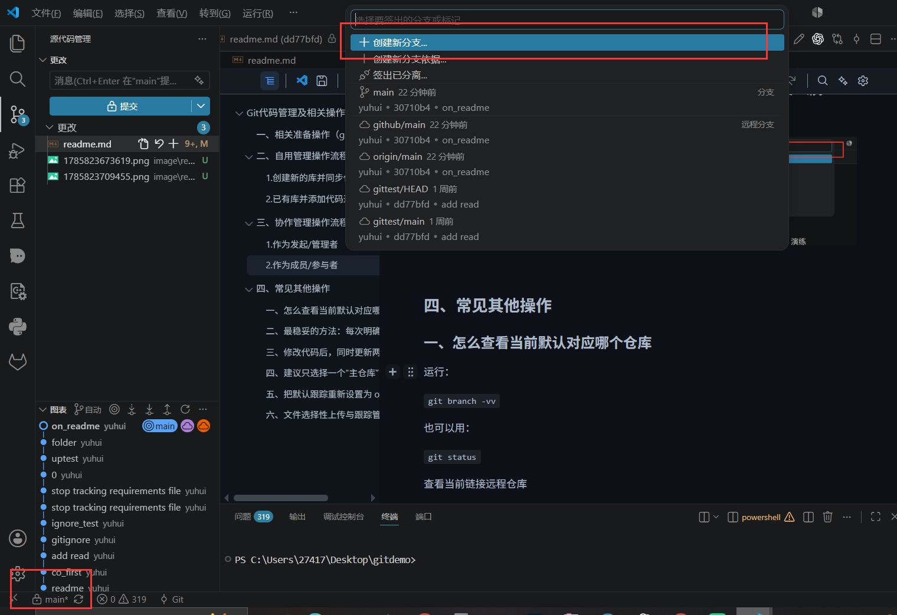

## 四、常见其他操作

### 一、怎么查看当前默认对应哪个仓库

运行：

`git branch -vv`

也可以用：

`git status`

查看当前链接远程仓库

`git remote -v`

### 二、最稳妥的方法：每次明确写远程名称

推送到原来的 `gitdemo`：

<pre class="overflow-visible! px-0!" data-start="689" data-end="727"><div class="relative w-full mt-4 mb-1"><div class=""><div class="contents"><div class="border border-token-border-light border-radius-3xl corner-superellipse/1.1 rounded-3xl"><div class="relative h-full w-full border-radius-3xl bg-(--code-block-surface) corner-superellipse/1.1 overflow-clip rounded-3xl [--code-block-surface:var(--bg-elevated-secondary)] dark:[--code-block-surface:var(--composer-surface-primary)] lxnfua_clipPathFallback"><div class="pointer-events-none absolute inset-x-4 top-12 bottom-4"><div class="pointer-events-none sticky z-40 shrink-0 z-1!"><div class="sticky bg-token-border-light"></div></div></div><div class="relative"><div class="h-full min-h-0 min-w-0"><div class="h-full min-h-0 min-w-0"><div class=""><div class="relative"><div class=""><div class="relative z-0 flex max-w-full"><div id="code-block-viewer" dir="ltr" class="q9tKkq_viewer cm-editor z-10 light:cm-light dark:cm-light flex h-full w-full flex-col items-stretch ?s ?16"><div class="cm-scroller"><pre class="cm-content q9tKkq_readonly m-0"><code><span class="?11">git</span><span></span><span class="?11">push</span><span></span><span class="?11">origin</span><span></span><span class="?11">main</span></code></pre></div></div></div></div></div></div></div></div><div class=""><div class=""></div></div></div></div></div></div></div></div></pre>

推送到新建的 `gittest`：

<pre class="overflow-visible! px-0!" data-start="748" data-end="787"><div class="relative w-full mt-4 mb-1"><div class=""><div class="contents"><div class="border border-token-border-light border-radius-3xl corner-superellipse/1.1 rounded-3xl"><div class="relative h-full w-full border-radius-3xl bg-(--code-block-surface) corner-superellipse/1.1 overflow-clip rounded-3xl [--code-block-surface:var(--bg-elevated-secondary)] dark:[--code-block-surface:var(--composer-surface-primary)] lxnfua_clipPathFallback"><div class="pointer-events-none absolute inset-x-4 top-12 bottom-4"><div class="pointer-events-none sticky z-40 shrink-0 z-1!"><div class="sticky bg-token-border-light"></div></div></div><div class="relative"><div class="h-full min-h-0 min-w-0"><div class="h-full min-h-0 min-w-0"><div class=""><div class="relative"><div class=""><div class="relative z-0 flex max-w-full"><div id="code-block-viewer" dir="ltr" class="q9tKkq_viewer cm-editor z-10 light:cm-light dark:cm-light flex h-full w-full flex-col items-stretch ?s ?16"><div class="cm-scroller"><pre class="cm-content q9tKkq_readonly m-0"><code><span class="?11">git</span><span></span><span class="?11">push</span><span></span><span class="?11">gittest</span><span></span><span class="?11">main</span></code></pre></div></div></div></div></div></div></div></div><div class=""><div class=""></div></div></div></div></div></div></div></div></pre>

从原仓库获取更新：

<pre class="overflow-visible! px-0!" data-start="800" data-end="838"><div class="relative w-full mt-4 mb-1"><div class=""><div class="contents"><div class="border border-token-border-light border-radius-3xl corner-superellipse/1.1 rounded-3xl"><div class="relative h-full w-full border-radius-3xl bg-(--code-block-surface) corner-superellipse/1.1 overflow-clip rounded-3xl [--code-block-surface:var(--bg-elevated-secondary)] dark:[--code-block-surface:var(--composer-surface-primary)] lxnfua_clipPathFallback"><div class="pointer-events-none absolute inset-x-4 top-12 bottom-4"><div class="pointer-events-none sticky z-40 shrink-0 z-1!"><div class="sticky bg-token-border-light"></div></div></div><div class="relative"><div class="h-full min-h-0 min-w-0"><div class="h-full min-h-0 min-w-0"><div class=""><div class="relative"><div class=""><div class="relative z-0 flex max-w-full"><div id="code-block-viewer" dir="ltr" class="q9tKkq_viewer cm-editor z-10 light:cm-light dark:cm-light flex h-full w-full flex-col items-stretch ?s ?16"><div class="cm-scroller"><pre class="cm-content q9tKkq_readonly m-0"><code><span class="?11">git</span><span></span><span class="?11">pull</span><span></span><span class="?11">origin</span><span></span><span class="?11">main</span></code></pre></div></div></div></div></div></div></div></div><div class=""><div class=""></div></div></div></div></div></div></div></div></pre>

从新仓库获取更新：

<pre class="overflow-visible! px-0!" data-start="851" data-end="890"><div class="relative w-full mt-4 mb-1"><div class=""><div class="contents"><div class="border border-token-border-light border-radius-3xl corner-superellipse/1.1 rounded-3xl"><div class="relative h-full w-full border-radius-3xl bg-(--code-block-surface) corner-superellipse/1.1 overflow-clip rounded-3xl [--code-block-surface:var(--bg-elevated-secondary)] dark:[--code-block-surface:var(--composer-surface-primary)] lxnfua_clipPathFallback"><div class="pointer-events-none absolute inset-x-4 top-12 bottom-4"><div class="pointer-events-none sticky z-40 shrink-0 z-1!"><div class="sticky bg-token-border-light"></div></div></div><div class="relative"><div class="h-full min-h-0 min-w-0"><div class="h-full min-h-0 min-w-0"><div class=""><div class="relative"><div class=""><div class="relative z-0 flex max-w-full"><div id="code-block-viewer" dir="ltr" class="q9tKkq_viewer cm-editor z-10 light:cm-light dark:cm-light flex h-full w-full flex-col items-stretch ?s ?16"><div class="cm-scroller"><pre class="cm-content q9tKkq_readonly m-0"><code><span class="?11">git</span><span></span><span class="?11">pull</span><span></span><span class="?11">gittest</span><span></span><span class="?11">main</span></code></pre></div></div></div></div></div></div></div></div><div class=""><div class=""></div></div></div></div></div></div></div></div></pre>

因此命令可以这样读：

<pre class="overflow-visible! px-0!" data-start="904" data-end="936"><div class="relative w-full mt-4 mb-1"><div class=""><div class="contents"><div class="relative"><div class="h-full min-h-0 min-w-0"><div class="h-full min-h-0 min-w-0"><div class="border border-token-border-light border-radius-3xl corner-superellipse/1.1 rounded-3xl"><div class="h-full w-full border-radius-3xl bg-(--code-block-surface) corner-superellipse/1.1 overflow-clip rounded-3xl [--code-block-surface:var(--bg-elevated-secondary)] dark:[--code-block-surface:var(--composer-surface-primary)] lxnfua_clipPathFallback"><div class="pointer-events-none absolute end-1.5 top-1 z-2 md:end-2 md:top-1"></div><div class="relative"><div class="pe-11 pt-3"><div class="relative z-0 flex max-w-full"><div id="code-block-viewer" dir="ltr" class="q9tKkq_viewer cm-editor z-10 light:cm-light dark:cm-light flex h-full w-full flex-col items-stretch ?s ?16"><div class="cm-scroller"><pre class="cm-content q9tKkq_readonly m-0"><code><span>git push 远程仓库别名 本地分支</span></code></pre></div></div></div></div></div></div></div></div></div></div></div></div></div></pre>

### 三、修改代码后，同时更新两个仓库

正常修改并提交：

<pre class="overflow-visible! px-0!" data-start="1046" data-end="1110"><div class="relative w-full mt-4 mb-1"><div class=""><div class="contents"><div class="border border-token-border-light border-radius-3xl corner-superellipse/1.1 rounded-3xl"><div class="relative h-full w-full border-radius-3xl bg-(--code-block-surface) corner-superellipse/1.1 overflow-clip rounded-3xl [--code-block-surface:var(--bg-elevated-secondary)] dark:[--code-block-surface:var(--composer-surface-primary)] lxnfua_clipPathFallback"><div class="pointer-events-none absolute inset-x-4 top-12 bottom-4"><div class="pointer-events-none sticky z-40 shrink-0 z-1!"><div class="sticky bg-token-border-light"></div></div></div><div class="relative"><div class="h-full min-h-0 min-w-0"><div class="h-full min-h-0 min-w-0"><div class=""><div class="relative"><div class=""><div class="relative z-0 flex max-w-full"><div id="code-block-viewer" dir="ltr" class="q9tKkq_viewer cm-editor z-10 light:cm-light dark:cm-light flex h-full w-full flex-col items-stretch ?s ?16"><div class="cm-scroller"><pre class="cm-content q9tKkq_readonly m-0"><code><span class="?11">git</span><span></span><span class="?11">add</span><span> .
</span><span class="?11">git</span><span></span><span class="?11">commit</span><span></span><span class="?v">-</span><span class="?11">m</span><span></span><span class="?z">"feat: update project"</span></code></pre></div></div></div></div></div></div></div></div><div class=""><div class=""></div></div></div></div></div></div></div></div></pre>

然后分别推送：

<pre class="overflow-visible! px-0!" data-start="1121" data-end="1181"><div class="relative w-full mt-4 mb-1"><div class=""><div class="contents"><div class="border border-token-border-light border-radius-3xl corner-superellipse/1.1 rounded-3xl"><div class="relative h-full w-full border-radius-3xl bg-(--code-block-surface) corner-superellipse/1.1 overflow-clip rounded-3xl [--code-block-surface:var(--bg-elevated-secondary)] dark:[--code-block-surface:var(--composer-surface-primary)] lxnfua_clipPathFallback"><div class="pointer-events-none absolute inset-x-4 top-12 bottom-4"><div class="pointer-events-none sticky z-40 shrink-0 z-1!"><div class="sticky bg-token-border-light"></div></div></div><div class="relative"><div class="h-full min-h-0 min-w-0"><div class="h-full min-h-0 min-w-0"><div class=""><div class="relative"><div class=""><div class="relative z-0 flex max-w-full"><div id="code-block-viewer" dir="ltr" class="q9tKkq_viewer cm-editor z-10 light:cm-light dark:cm-light flex h-full w-full flex-col items-stretch ?s ?16"><div class="cm-scroller"><pre class="cm-content q9tKkq_readonly m-0"><code><span class="?11">git</span><span></span><span class="?11">push</span><span></span><span class="?11">origin</span><span></span><span class="?11">main</span><span>
</span><span class="?11">git</span><span></span><span class="?11">push</span><span></span><span class="?11">gittest</span><span></span><span class="?11">main</span></code></pre></div></div></div></div></div></div></div></div><div class=""><div class=""></div></div></div></div></div></div></div></div></pre>

这样同一个本地 commit 会同时存在于两个 GitHub 仓库中。

### 四、建议只选择一个“主仓库”

不建议两个仓库都让不同成员独立修改，否则容易出现：

<pre class="overflow-visible! px-0!" data-start="1417" data-end="1482"><div class="relative w-full mt-4 mb-1"><div class=""><div class="contents"><div class="relative"><div class="h-full min-h-0 min-w-0"><div class="h-full min-h-0 min-w-0"><div class="border border-token-border-light border-radius-3xl corner-superellipse/1.1 rounded-3xl"><div class="h-full w-full border-radius-3xl bg-(--code-block-surface) corner-superellipse/1.1 overflow-clip rounded-3xl [--code-block-surface:var(--bg-elevated-secondary)] dark:[--code-block-surface:var(--composer-surface-primary)] lxnfua_clipPathFallback"><div class="pointer-events-none absolute end-1.5 top-1 z-2 md:end-2 md:top-1"></div><div class="relative"><div class="pe-11 pt-3"><div class="relative z-0 flex max-w-full"><div id="code-block-viewer" dir="ltr" class="q9tKkq_viewer cm-editor z-10 light:cm-light dark:cm-light flex h-full w-full flex-col items-stretch ?s ?16"><div class="cm-scroller"><pre class="cm-content q9tKkq_readonly m-0"><code><span>origin/main 有提交 A
gittest/main 有提交 B
本地无法直接同时跟随两套不同历史</span></code></pre></div></div></div></div></div></div></div></div></div><div class=""><div class=""></div></div></div></div></div></div></pre>

最好明确：

<pre class="overflow-visible! px-0!" data-start="1491" data-end="1547"><div class="relative w-full mt-4 mb-1"><div class=""><div class="contents"><div class="relative"><div class="h-full min-h-0 min-w-0"><div class="h-full min-h-0 min-w-0"><div class="border border-token-border-light border-radius-3xl corner-superellipse/1.1 rounded-3xl"><div class="h-full w-full border-radius-3xl bg-(--code-block-surface) corner-superellipse/1.1 overflow-clip rounded-3xl [--code-block-surface:var(--bg-elevated-secondary)] dark:[--code-block-surface:var(--composer-surface-primary)] lxnfua_clipPathFallback"><div class="pointer-events-none absolute end-1.5 top-1 z-2 md:end-2 md:top-1"></div><div class="relative"><div class="pe-11 pt-3"><div class="relative z-0 flex max-w-full"><div id="code-block-viewer" dir="ltr" class="q9tKkq_viewer cm-editor z-10 light:cm-light dark:cm-light flex h-full w-full flex-col items-stretch ?s ?16"><div class="cm-scroller"><pre class="cm-content q9tKkq_readonly m-0"><code><span>origin/main   主仓库，日常协作
gittest/main  备份或测试仓库</span></code></pre></div></div></div></div></div></div></div></div></div><div class=""><div class=""></div></div></div></div></div></div></pre>

那么日常使用：

<pre class="overflow-visible! px-0!" data-start="1558" data-end="1617"><div class="relative w-full mt-4 mb-1"><div class=""><div class="contents"><div class="border border-token-border-light border-radius-3xl corner-superellipse/1.1 rounded-3xl"><div class="relative h-full w-full border-radius-3xl bg-(--code-block-surface) corner-superellipse/1.1 overflow-clip rounded-3xl [--code-block-surface:var(--bg-elevated-secondary)] dark:[--code-block-surface:var(--composer-surface-primary)] lxnfua_clipPathFallback"><div class="pointer-events-none absolute inset-x-4 top-12 bottom-4"><div class="pointer-events-none sticky z-40 shrink-0 z-1!"><div class="sticky bg-token-border-light"></div></div></div><div class="relative"><div class="h-full min-h-0 min-w-0"><div class="h-full min-h-0 min-w-0"><div class=""><div class="relative"><div class=""><div class="relative z-0 flex max-w-full"><div id="code-block-viewer" dir="ltr" class="q9tKkq_viewer cm-editor z-10 light:cm-light dark:cm-light flex h-full w-full flex-col items-stretch ?s ?16"><div class="cm-scroller"><pre class="cm-content q9tKkq_readonly m-0"><code><span class="?11">git</span><span></span><span class="?11">pull</span><span></span><span class="?11">origin</span><span></span><span class="?11">main</span><span>
</span><span class="?11">git</span><span></span><span class="?11">push</span><span></span><span class="?11">origin</span><span></span><span class="?11">main</span></code></pre></div></div></div></div></div></div></div></div><div class=""><div class=""></div></div></div></div></div></div></div></div></pre>

需要同步备份时：

<pre class="overflow-visible! px-0!" data-start="1629" data-end="1668"><div class="relative w-full mt-4 mb-1"><div class=""><div class="contents"><div class="border border-token-border-light border-radius-3xl corner-superellipse/1.1 rounded-3xl"><div class="relative h-full w-full border-radius-3xl bg-(--code-block-surface) corner-superellipse/1.1 overflow-clip rounded-3xl [--code-block-surface:var(--bg-elevated-secondary)] dark:[--code-block-surface:var(--composer-surface-primary)] lxnfua_clipPathFallback"><div class="pointer-events-none absolute inset-x-4 top-12 bottom-4"><div class="pointer-events-none sticky z-40 shrink-0 z-1!"><div class="sticky bg-token-border-light"></div></div></div><div class="relative"><div class="h-full min-h-0 min-w-0"><div class="h-full min-h-0 min-w-0"><div class=""><div class="relative"><div class=""><div class="relative z-0 flex max-w-full"><div id="code-block-viewer" dir="ltr" class="q9tKkq_viewer cm-editor z-10 light:cm-light dark:cm-light flex h-full w-full flex-col items-stretch ?s ?16"><div class="cm-scroller"><pre class="cm-content q9tKkq_readonly m-0"><code><span class="?11">git</span><span></span><span class="?11">push</span><span></span><span class="?11">gittest</span><span></span><span class="?11">main</span></code></pre></div></div></div></div></div></div></div></div></div></div></div></div></div></div></pre>

### 五、把默认跟踪重新设置为 origin/main

因为你刚才使用了：

git push -u gittest main

当前默认大概率已经是 gittest/main。若想让原仓库继续作为主仓库，可以执行：

git fetch origin
git branch --set-upstream-to=origin/main main

再检查：

git branch -vv

看到：

* main ... [origin/main] ...

就说明设置成功。

### 六、文件选择性上传与跟踪管理

新建`.gitignore`文件里面标明不需要上传的文件/文件夹，例如**下载安装的配置文件/下载的项目环境依赖/工程产生的运行文件**等等

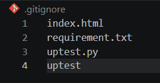

这些文件将在后续的更改中被git忽视跟踪，修改/新增/删除都不会产生相应的同步变化到本地和远程仓库中

> ！！！注意只有在git没有事先跟踪过这些文件下才生效，比如之前已经commit/sync这些文件，之后才新建`.gitignore`把这些文件写进去，相当于本地仓库已经跟踪过，那此时的`gitignore`无法生效
> 如需删除跟踪关系，终端输入`git rm --cached requirement.txt`,同时`.gitignore`中加入该文件名即可在新一次的commit/sync中取消上传

```
git rm --cached requirement.txt
```
